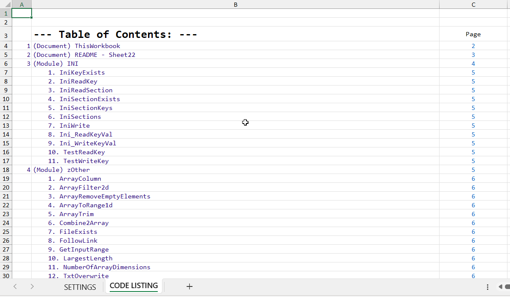
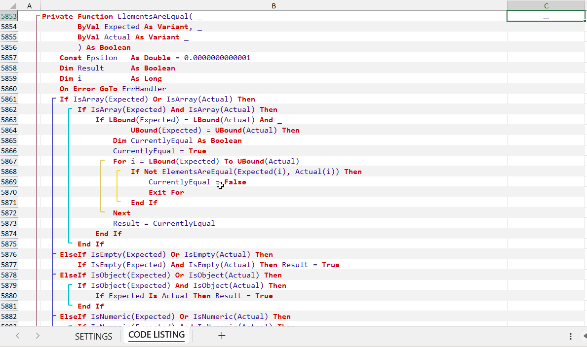
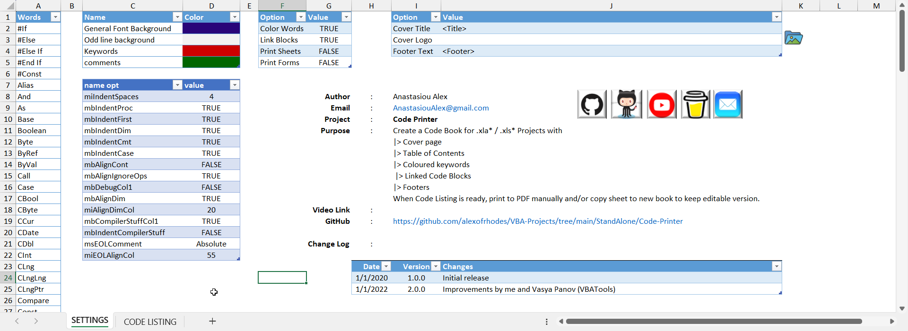

Export vba code with selected color scheme, code blocks linked and table of contents.  
Code placed in 1 or multiple columns by indentation (1 column prints better).  
Code formatting (indentation, comment and blank lines removal, long line folding).  
After checking all is well you can export to PDF.  

Example output:  

